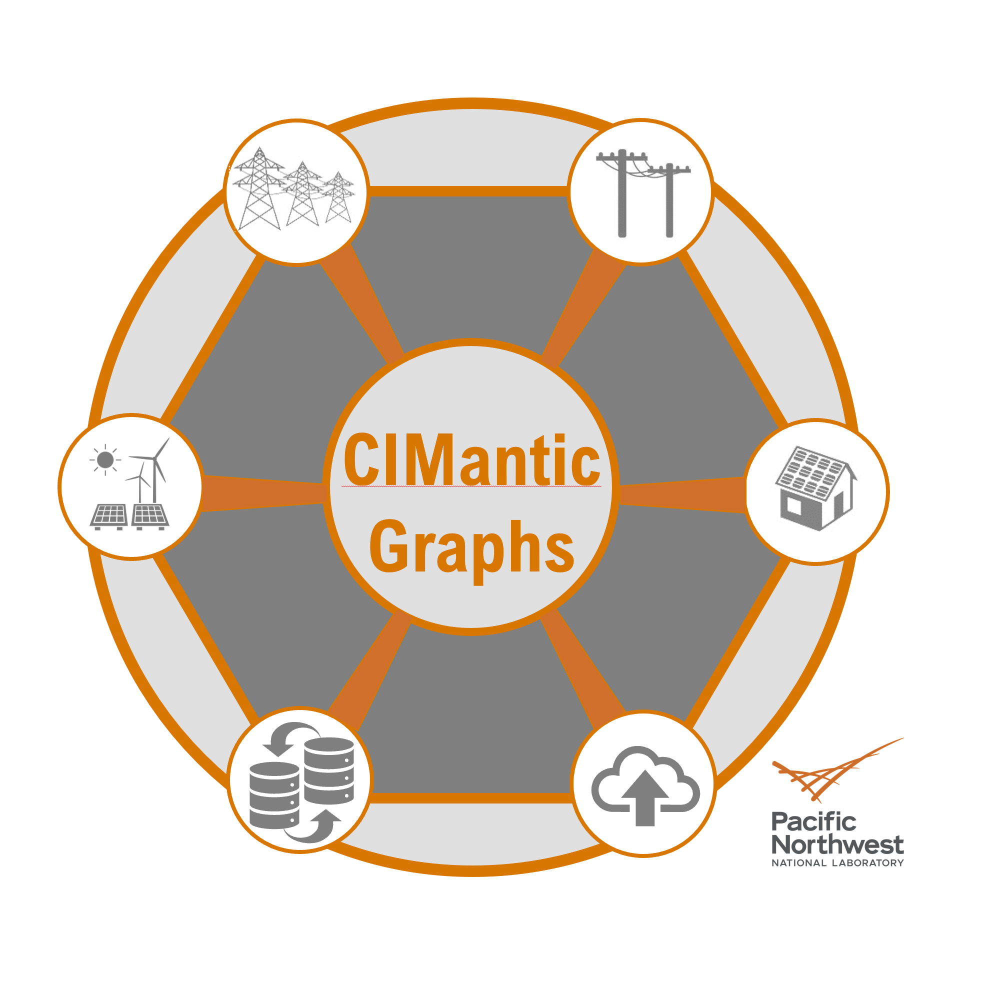

.. CIMantic Graphs

================================================
CIMantic Graphs Library Documentation
================================================

Python library for creating in-memory labeled property graphs for creating, parsing, and editing CIM power system models. It creates Python object instances in memory using a data profile exported from a specified CIM profile (e.g. IEC61970cim18v01 or GridAPPS-D CIM100 RC4_2021).

The library is being expanded to cover centralized applications, transmission models, and real-time editing of CIM XML models natively.

To install CIMantic Graphs clone the github repository or use pip install: pip install cim-graph

.. toctree::
   :caption: Overview
   :maxdepth: 2

   01_overview
   02_connections
   03_feeder_model
   04_busbranch_model
